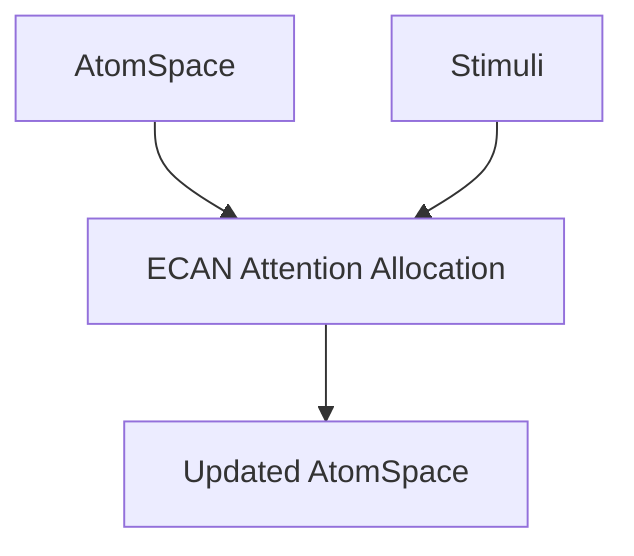

@models:
  name: ECAN
  description: "Implements Economic Attention Allocation for dynamic focus modulation in hypergraphs."
  inputs: 
    - atomspace: "Hypergraph structure"
    - stimuli: "Attention signals"
  outputs: 
    - updated-atomspace: "Resonance-weighted hypergraph"
  implementation: "Scheme"



```scheme
(define-skill ECAN
  (lambda (atomspace stimuli)
    (ecan-update-attention atomspace stimuli)))
```