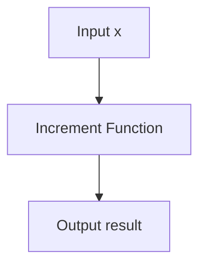

@models:
  name: increment
  description: "Adds 1 to input x."
  inputs: { x: "number" }
  outputs: { result: "number" }
  implementation: "Scheme"



```scheme
(define-skill increment
  (lambda (x)
    (+ x 1)))
```