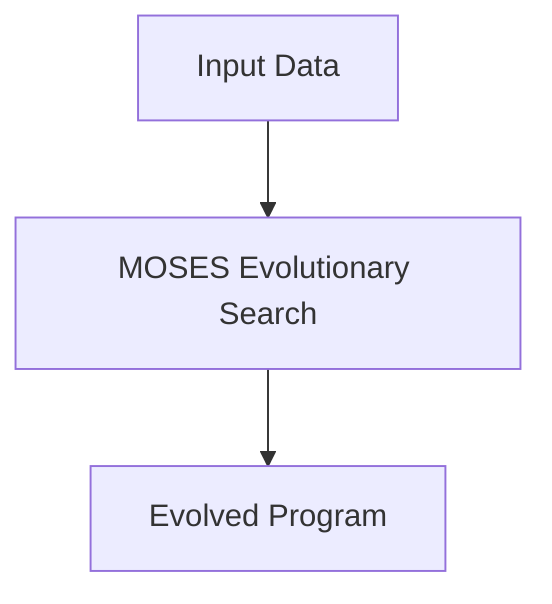

@models:
  name: MOSES
  description: "Performs meta-optimizing program evolution for cognitive pattern discovery."
  inputs:
    - data: "Feature-set or cognitive context"
  outputs:
    - evolved-program: "Optimized cognitive program"
  implementation: "Scheme"



```scheme
(define-skill MOSES
  (lambda (data)
    (moses-evolve-program data)))
```