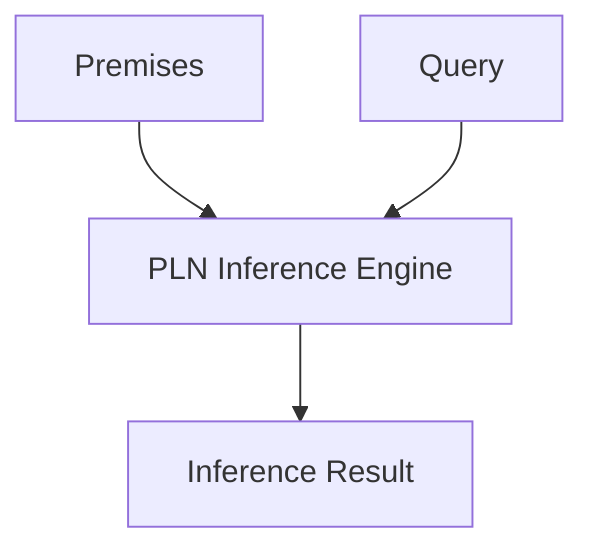

@models:
  name: PLN
  description: "Executes probabilistic inference over hypergraph patterns."
  inputs:
    - premises: "Hypergraph assertions"
    - query: "Inference target"
  outputs:
    - result: "Probabilistic inference result"
  implementation: "Scheme"



```scheme
(define-skill PLN
  (lambda (premises query)
    (pln-infer premises query)))
```