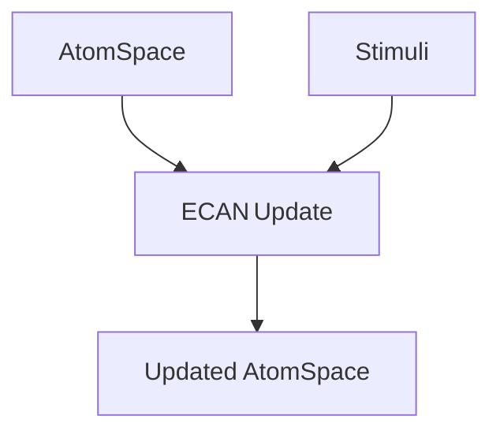

@models:
  name: ECAN
  description: "Economic Attention Allocation — dynamically modulates focus weights on AtomSpace links."
  inputs:
    atomspace:      "Hypergraph structure"
    stimuli:        "Attention signals (list of <Atom, value>)"
  outputs:
    updated-space:  "Resonance-weighted AtomSpace"
  implementation:   "Scheme"
  tags: ["attention", "hypergraph", "opencog"]



```scheme
;; ECAN skill — assumes (ecan-update-attention …) exists in runtime
(define-skill ECAN
  (lambda (atomspace stimuli)
    (ecan-update-attention atomspace stimuli)))
```