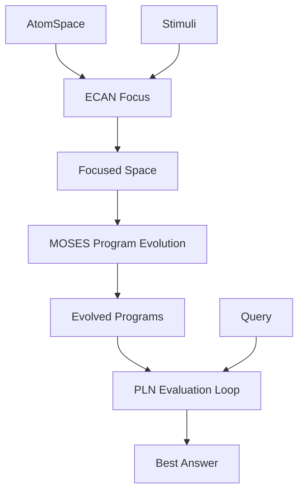

@models:
  name: Hypercognition
  description: |
    Meta-skill that:
      1. Applies ECAN to focus the AtomSpace,
      2. Uses MOSES to evolve candidate reasoning programs,
      3. Invokes PLN on each candidate and returns the best-valued answer.
  inputs:
    atomspace: "Full hypergraph context"
    stimuli:   "Attention cues"
    query:     "User-level cognitive question"
  outputs:
    answer:    "Best inference (truth-value + program)"
  implementation: "Scheme"
  tags: ["meta", "pipeline", "adaptive"]



```scheme
;; Hypercognition meta-skill — demonstrates recursive orchestration
(define-skill Hypercognition
  (lambda (atomspace stimuli query)

    ;; 1. Attention re-weighting
    (let* ((focused-space (ECAN atomspace stimuli))

           ;; 2. Program evolution
           (candidates    (MOSES focused-space))

           ;; 3. Evaluate each candidate via PLN, keep best truth-value
           (best (foldl
                  (lambda (prog current-best)
                    (let ((val (PLN focused-space (apply prog query))))
                      (if (> (truth-strength val) (truth-strength (cdr current-best)))
                          (cons prog val)
                          current-best)))
                  (cons #f (make-truth-value 0 0))
                  candidates)))
      (cons (car best) (cdr best))))
```