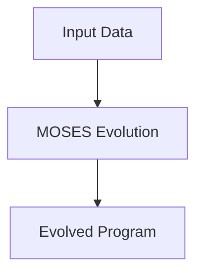

@models:
  name: MOSES
  description: "Meta-Optimizing Semantic Evolutionary Search — evolves cognitive programs / patterns."
  inputs:
    data:             "Feature-set or cognitive context"
    search-params?:   "Optional MOSES parameter list"
  outputs:
    evolved-program:  "Optimized Scheme/hypergraph program"
  implementation:     "Scheme"
  tags: ["evolution", "program-synthesis", "opencog"]



```scheme
;; MOSES skill — thin wrapper around core MOSES driver
(define-skill MOSES
  (lambda (data #:optional search-params)
    (moses-evolve-program data search-params)))
```