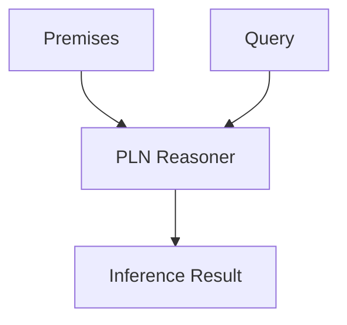

@models:
  name: PLN
  description: "Probabilistic Logic Networks — derives probabilistic truth values for queries."
  inputs:
    premises: "Hypergraph assertions"
    query:    "Target pattern / expression"
  outputs:
    result:   "Truth-value with strength & confidence"
  implementation: "Scheme"
  tags: ["inference", "logic", "opencog"]



```scheme
;; PLN skill — bridges to core inference engine
(define-skill PLN
  (lambda (premises query)
    (pln-infer premises query)))
```